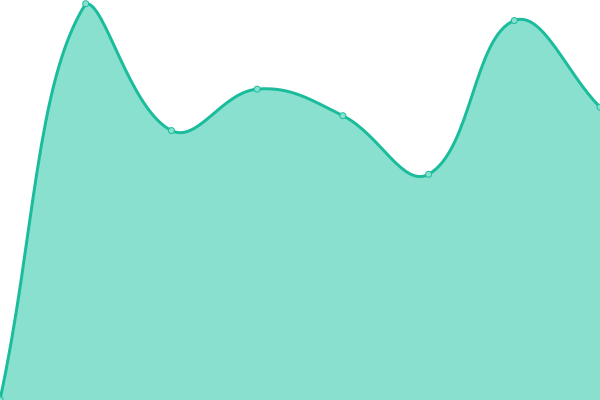
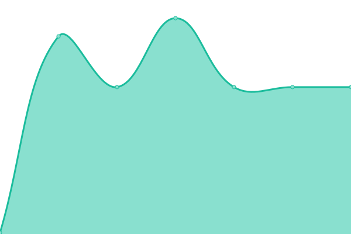

# [📈 Live Status](https://status.imagix.tech): <!--live status--> **🟩 All systems operational**

This repository contains the open-source uptime monitor and status page for [IMAGIX TECH](https://imagix.tech), powered by [Upptime](https://github.com/upptime/upptime).

With [Upptime](https://upptime.js.org), you can get your own unlimited and free uptime monitor and status page, powered entirely by a GitHub repository. We use [Issues](https://github.com/imagix-tech/status/issues) as incident reports, [Actions](https://github.com/imagix-tech/status/actions) as uptime monitors, and [Pages](https://status.imagix.tech) for the status page.

<!--start: status pages-->
<!-- This summary is generated by Upptime (https://github.com/upptime/upptime) -->
<!-- Do not edit this manually, your changes will be overwritten -->
<!-- prettier-ignore -->
| URL | Status | History | Response Time | Uptime |
| --- | ------ | ------- | ------------- | ------ |
|  [Website](https://imagix.tech) | 🟩 Up | [website.yml](https://github.com/imagix-tech/status/commits/HEAD/history/website.yml) | 

 967ms
     
 | 

<a href="https://status.imagix.tech/history/website">100.00%</a>
    

|  [Webmail](https://webmail.imagix.tech) | 🟩 Up | [webmail.yml](https://github.com/imagix-tech/status/commits/HEAD/history/webmail.yml) | 

 1185ms
     
 | 

<a href="https://status.imagix.tech/history/webmail">100.00%</a>
    

|  [Suporte](https://suporte.imagix.tech) | 🟩 Up | [suporte.yml](https://github.com/imagix-tech/status/commits/HEAD/history/suporte.yml) | 

 1117ms
     
 | 

<a href="https://status.imagix.tech/history/suporte">100.00%</a>
    

|  [ODIN (Homologation)](https://hmg-app.demo.odin.imagix.tech) | 🟩 Up | [odin-homologation.yml](https://github.com/imagix-tech/status/commits/HEAD/history/odin-homologation.yml) | 

 879ms
     
 | 

<a href="https://status.imagix.tech/history/odin-homologation">100.00%</a>
    

|  [ODIN API (Homologation)](http://hmg-api.demo.odin.imagix.tech/healthz) | 🟩 Up | [odin-api-homologation.yml](https://github.com/imagix-tech/status/commits/HEAD/history/odin-api-homologation.yml) | 

 538ms
     
 | 

<a href="https://status.imagix.tech/history/odin-api-homologation">100.00%</a>
    

|  [BIFROST (Homologation)](https://hmg-app.demo.bifrost.imagix.tech) | 🟩 Up | [bifrost-homologation.yml](https://github.com/imagix-tech/status/commits/HEAD/history/bifrost-homologation.yml) | 

 839ms
     
 | 

<a href="https://status.imagix.tech/history/bifrost-homologation">100.00%</a>
    

|  [BIFROST API (Homologation)](https://hmg-api.demo.bifrost.imagix.tech/health) | 🟩 Up | [bifrost-api-homologation.yml](https://github.com/imagix-tech/status/commits/HEAD/history/bifrost-api-homologation.yml) | 

 767ms
     
 | 

<a href="https://status.imagix.tech/history/bifrost-api-homologation">100.00%</a>
    

|  [DNS 1](dns1.xaonix.com) | 🟩 Up | [dns-1.yml](https://github.com/imagix-tech/status/commits/HEAD/history/dns-1.yml) | 

 139ms
     
 | 

<a href="https://status.imagix.tech/history/dns-1">100.00%</a>
    

|  [DNS 2](dns2.xaonix.com) | 🟩 Up | [dns-2.yml](https://github.com/imagix-tech/status/commits/HEAD/history/dns-2.yml) | 

 82ms
     
 | 

<a href="https://status.imagix.tech/history/dns-2">100.00%</a>
    

|  [DNS 3](dns3.uni5.net) | 🟩 Up | [dns-3.yml](https://github.com/imagix-tech/status/commits/HEAD/history/dns-3.yml) | 

 8ms
     
 | 

<a href="https://status.imagix.tech/history/dns-3">100.00%</a>
    

|  [DNS 4](dns4.uni5.net) | 🟩 Up | [dns-4.yml](https://github.com/imagix-tech/status/commits/HEAD/history/dns-4.yml) | 

 8ms
     
 | 

<a href="https://status.imagix.tech/history/dns-4">100.00%</a>
    

<!--end: status pages-->

[**Visit our status website →**](https://status.imagix.tech)

## 📄 License

- Powered by: [Upptime](https://github.com/upptime/upptime)
- Code: [MIT](./LICENSE) © [Anand Chowdhary](https://anandchowdhary.com), supported by [Pabio](https://pabio.com)
- Data in the `./history` directory: [Open Database License](https://opendatacommons.org/licenses/odbl/1-0/)
